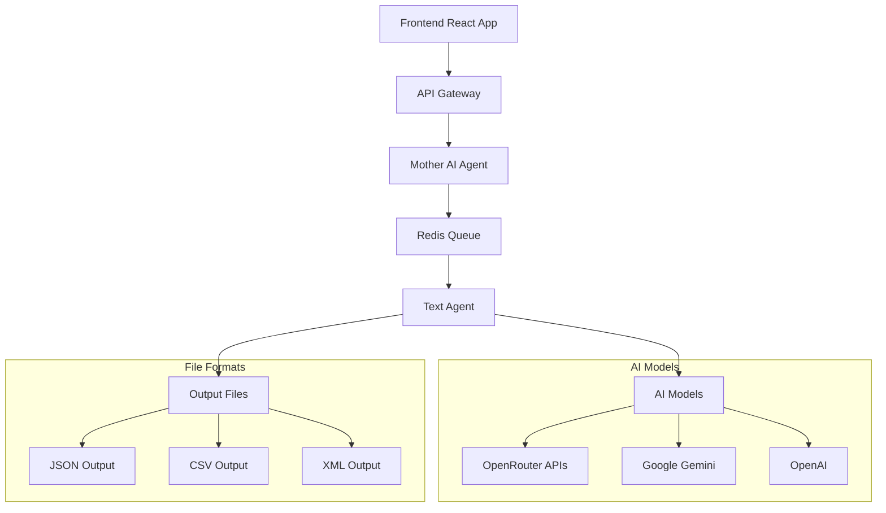

# Multi-Agent Text Labeling System

A sophisticated AI-powered text classification system that uses multiple AI agents for intelligent text analysis and labeling. The system supports multiple file formats (JSON, CSV, XML) and maintains the original file structure in outputs.

## 🌟 Features

### Core Capabilities
- **Multi-Format Support**: JSON, CSV, and XML file processing
- **Format Preservation**: Output files maintain the same format as input files
- **Real AI Classification**: Uses OpenRouter, Gemini, and OpenAI APIs for actual text analysis
- **Multi-Agent Architecture**: Mother AI orchestrates Child AI agents for optimal classification
- **Model Selection**: Choose from multiple AI models for both orchestration and classification
- **Progress Tracking**: Real-time progress updates with WebSocket integration
- **Metadata Preservation**: Maintains original file structure and metadata

### Supported AI Models
#### OpenRouter Models
- DeepSeek R1 (deepseek/deepseek-r1-distill-llama-70b)
- Mistral Small (mistralai/mistral-small)
- Meta Llama (meta-llama/llama-4-scout:free)
- Moonshot Kimi (moonshot/moonshot-v1-8k)

#### Google Gemini Models
- Gemini 1.5 Flash (gemini-1.5-flash)
- Gemini 1.5 Flash 8B (gemini-1.5-flash-8b)

## 🏗️ System Architecture



## 📋 Prerequisites

- **Python 3.8+**
- **Node.js 16+** and npm
- **Docker** (for Redis)
- **API Keys** for AI services:
  - OpenRouter API key
  - Google Gemini API key
  - OpenAI API key (optional)

## 🚀 Quick Start

### 1. Clone the Repository
```bash
git clone <repository-url>
cd data_label_agent
```

### 2. Set Up API Keys
```bash
python setup_api_keys.py
```

Follow the prompts to enter your API keys:
- **OpenRouter API Key**: Get from [openrouter.ai](https://openrouter.ai)
- **Gemini API Key**: Get from [Google AI Studio](https://aistudio.google.com/app/apikey)
- **OpenAI API Key**: Get from [OpenAI Platform](https://platform.openai.com/api-keys) (optional)

### 3. Start the System
```bash
./start_all.sh
```

This will:
- Start Redis container
- Activate Python virtual environment
- Start all backend services (API Gateway, Mother AI, Text Agent)
- Start the React frontend
- Display access URLs

### 4. Access the Application
- **Frontend**: http://localhost:5173
- **API Gateway**: http://localhost:8000
- **Health Check**: http://localhost:8000/health

## 📖 Usage Guide

### File Upload and Processing

1. **Select AI Models**:
   - Choose a Mother AI model for orchestration
   - Choose a Child AI model for text classification

2. **Upload File**:
   - Supported formats: `.json`, `.csv`, `.xml`
   - File structure requirements:
     - **JSON**: Must contain `test_texts` array
     - **CSV**: Must have a text column (auto-detected)
     - **XML**: Must contain text elements (auto-detected)

3. **Configure Labels**:
   - Enter comma-separated labels (e.g., `product_review, news, science_research`)
   - AI will assign ONE label per text

4. **Provide Instructions**:
   - Give clear guidance for classification
   - Instructions help AI models make accurate decisions

5. **Process and Download**:
   - Monitor real-time progress
   - Download results in the same format as input

### File Format Examples

#### JSON Input
```json
{
  "test_texts": [
    {
      "id": "text_001",
      "content": "I love this smartphone! Great camera quality."
    },
    {
      "id": "text_002", 
      "content": "Scientists discovered a new species of deep-sea fish."
    }
  ]
}
```

#### CSV Input
```csv
id,content,category,author
text_001,"I love this smartphone! Great camera quality.",electronics,user123
text_002,"Scientists discovered a new species of deep-sea fish.",science,researcher456
```

#### XML Input
```xml
<?xml version="1.0" encoding="UTF-8"?>
<texts>
  <text id="text_001" category="electronics">
    <content>I love this smartphone! Great camera quality.</content>
  </text>
  <text id="text_002" category="science">
    <content>Scientists discovered a new species of deep-sea fish.</content>
  </text>
</texts>
```

### Output Examples

The system preserves the original format and adds `ai_assigned_label`:

#### JSON Output
```json
{
  "test_texts": [
    {
      "id": "text_001",
      "content": "I love this smartphone! Great camera quality.",
      "ai_assigned_label": "product_review"
    }
  ]
}
```

#### CSV Output
```csv
id,content,category,author,ai_assigned_label
text_001,"I love this smartphone! Great camera quality.",electronics,user123,product_review
text_002,"Scientists discovered a new species of deep-sea fish.",science,researcher456,science_research
```

#### XML Output
```xml
<?xml version="1.0" encoding="UTF-8"?>
<texts>
  <text id="text_001" category="electronics" ai_assigned_label="product_review">
    <content>I love this smartphone! Great camera quality.</content>
  </text>
  <text id="text_002" category="science" ai_assigned_label="science_research">
    <content>Scientists discovered a new species of deep-sea fish.</content>
  </text>
</texts>
```

## 🛠️ Manual Setup (Alternative)

### Backend Setup
```bash
cd backend

# Create virtual environment
python -m venv venv
source venv/bin/activate  # On Windows: venv\Scripts\activate

# Install dependencies
pip install -r api_gateway/requirements.txt
pip install -r mother_ai/requirements.txt
pip install -r agents/text_agent/requirements.txt

# Start Redis
docker run -d --name redis -p 6379:6379 redis:latest

# Start services manually
./start_backend.sh
```

### Frontend Setup
```bash
cd frontend

# Install dependencies
npm install

# Start development server
npm run dev
```

## 🔧 Configuration

### Environment Variables
Create a `.env` file in the project root:
```env
# API Keys
OPENROUTER_API_KEY=your_openrouter_key_here
GEMINI_API_KEY=your_gemini_key_here
OPENAI_API_KEY=your_openai_key_here

# Service Configuration
REDIS_HOST=localhost
REDIS_PORT=6379
API_GATEWAY_PORT=8000
FRONTEND_PORT=5173
```

### Model Configuration
Edit `backend/common/config.py` to modify default models:
```python
class Settings:
    DEFAULT_OPENROUTER_MODEL = "deepseek/deepseek-r1-distill-llama-70b"
    DEFAULT_GEMINI_MODEL = "gemini-1.5-flash"
    DEFAULT_OPENAI_MODEL = "gpt-4o-mini"
```

## 📊 API Reference

### Submit Batch Job
```http
POST /api/v1/submit-batch-job
Content-Type: multipart/form-data

file: [File] (JSON/CSV/XML)
labels: "product_review,news,science_research"
instructions: "Classify each text appropriately"
mother_ai_model: "deepseek/deepseek-r1-distill-llama-70b"
child_ai_model: "gemini-1.5-flash"
```

### Get Job Status
```http
GET /api/v1/jobs/{job_id}
```

### Download Result
```http
GET /api/v1/jobs/{job_id}/download
```

### WebSocket Progress
```javascript
const ws = new WebSocket('ws://localhost:8000/ws');
ws.send(JSON.stringify({type: 'subscribe', job_id: 'your-job-id'}));
```

## 🔍 Troubleshooting

### Common Issues

#### "NO API KEYS CONFIGURED"
**Solution**: Run the setup script and enter valid API keys
```bash
python setup_api_keys.py
```

#### "Failed to fetch" Error
**Cause**: Backend services not running
**Solution**: Start the backend services
```bash
./start_all.sh
```

#### Redis Connection Error
**Cause**: Redis container not running
**Solution**: Start Redis manually
```bash
docker run -d --name redis -p 6379:6379 redis:latest
```

#### API Rate Limits
**Cause**: API quota exhausted
**Solution**: 
- Wait for quota reset
- Use different API keys
- Switch to different AI models

#### File Format Not Recognized
**Cause**: Unsupported file structure
**Solution**: Ensure files follow the required format:
- JSON: Must have `test_texts` array
- CSV: Must have identifiable text columns
- XML: Must have text elements

### Debug Mode
Enable verbose logging by setting:
```bash
export DEBUG=true
./start_all.sh
```

### Log Files
Check logs for detailed error information:
```bash
# Backend logs
tail -f backend/logs/api_gateway.log
tail -f backend/logs/mother_ai.log
tail -f backend/logs/text_agent.log

# Job-specific logs
ls data/outputs/job_*_metadata.log
```

## 🧪 Testing

### Test Files
The repository includes sample test files:
- `test_dataset.json`: Sample JSON format
- `test_dataset.csv`: Sample CSV format
- `test_dataset.xml`: Sample XML format

### Manual Testing
```bash
# Test API health
curl http://localhost:8000/health

# Test file upload
curl -X POST http://localhost:8000/api/v1/submit-batch-job \
  -F "file=@test_dataset.json" \
  -F "labels=product_review,news,science_research" \
  -F "instructions=Classify each text appropriately" \
  -F "mother_ai_model=gemini-1.5-flash" \
  -F "child_ai_model=gemini-1.5-flash"
```

## 📈 Performance

### Recommended Configurations
- **Small datasets** (< 100 texts): Any model combination
- **Medium datasets** (100-1000 texts): Use fast models like Gemini Flash
- **Large datasets** (> 1000 texts): Consider rate limits and use multiple API keys

### Processing Speed
- **Average**: 2-5 seconds per text (depending on model and API response time)
- **Throughput**: Limited by API rate limits
- **Optimization**: Use faster models for Child AI if accuracy permits

## 🤝 Contributing

1. Fork the repository
2. Create a feature branch (`git checkout -b feature/amazing-feature`)
3. Commit your changes (`git commit -m 'Add some amazing feature'`)
4. Push to the branch (`git push origin feature/amazing-feature`)
5. Open a Pull Request

## 📄 License

This project is licensed under the MIT License - see the [LICENSE](LICENSE) file for details.

## 🆘 Support

For support and questions:
1. Check the troubleshooting section above
2. Review the [Issues](../../issues) page
3. Create a new issue with detailed error information

## 🔮 Roadmap

- [ ] Batch processing optimization
- [ ] Custom AI model integration
- [ ] Advanced filtering and search
- [ ] Export to additional formats (Excel, PDF)
- [ ] Multi-language support
- [ ] Advanced analytics dashboard
- [ ] API rate limit optimization
- [ ] Automated testing suite

---

**Happy Text Labeling! 🏷️✨**

